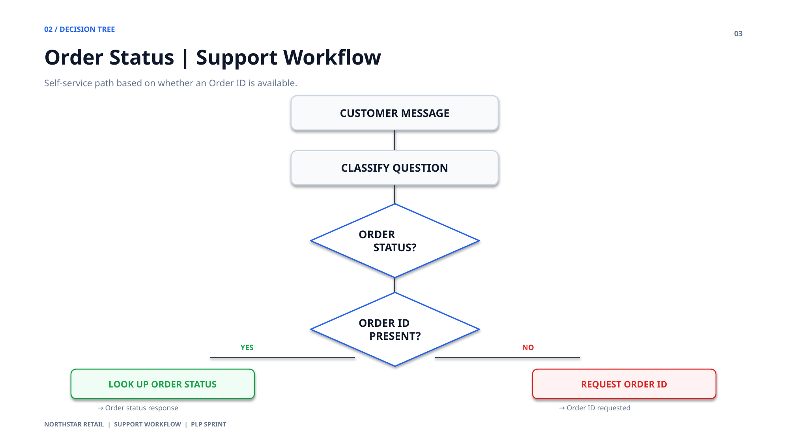
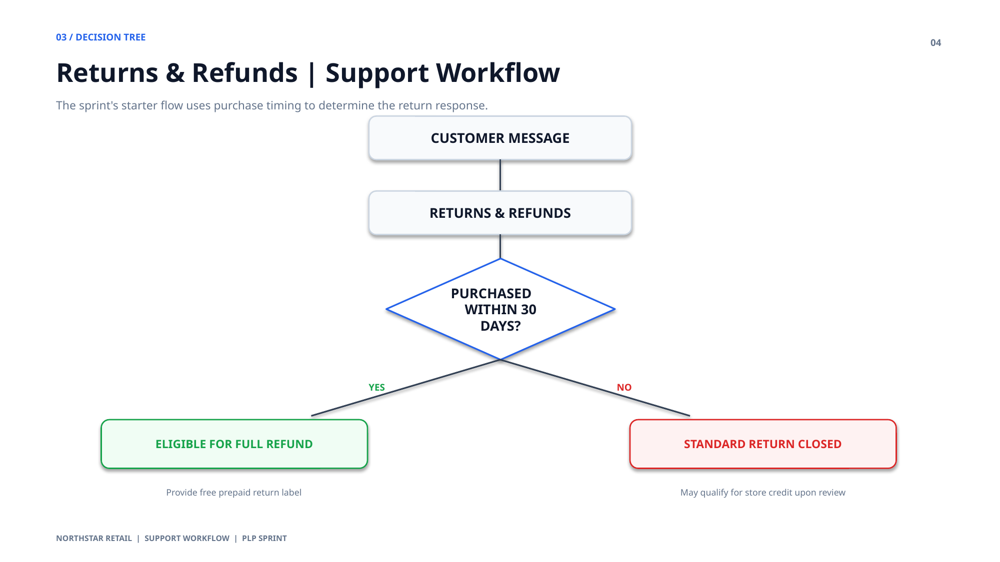

# Northstar Retail — Support Workflow Decision Trees

These decision trees are the implementation-ready workflow reference for the Northstar support portal.

## 1. Order Status — Support Workflow

**Flow:** Customer Message → Classify Question → Order Status → Order ID Present?

- **Yes** → Look Up Order Status → Order status response
- **No** → Request Order ID → Order ID requested

## 2. Returns & Refunds — Support Workflow

**Flow:** Customer Message → Returns & Refunds → Purchased Within 30 Days?

- **Yes** → Eligible for Full Refund → Provide free prepaid return label
- **No** → Standard Return Closed → May qualify for store credit upon review

- 

